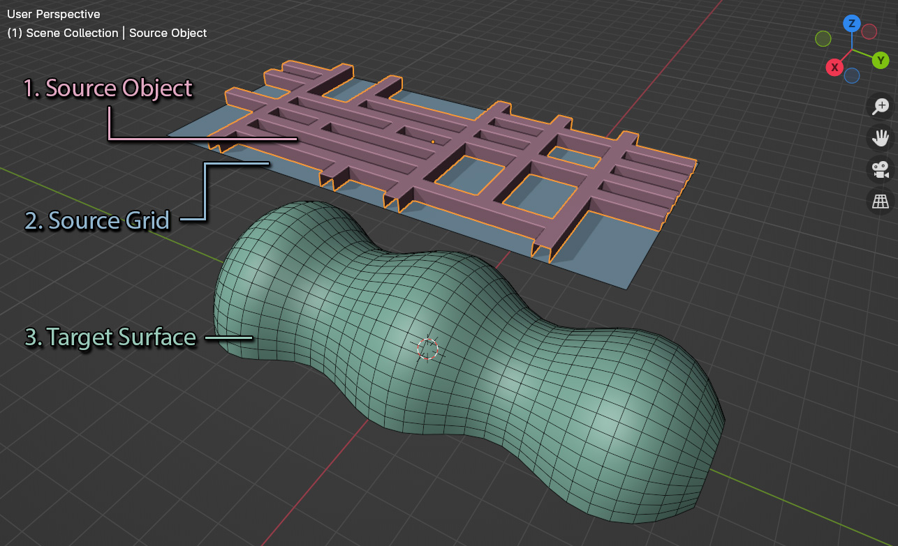

.. Flowify documentation master file, created by
   sphinx-quickstart on Sat Nov 11 17:11:53 2023.
   You can adapt this file completely to your liking, but it should at least
   contain the root `toctree` directive.

Flowify
===================================

.. image:: images/flowify_in_action.gif
  :alt: Perspective Plotter at work

---------------------------------
What is Flowify?
---------------------------------

|Flowify| is a Blender add-on for 3D modelers that allows them to map an object, called the **Source Object**, to a surface object with evenly spaced four sided faces and four corners, called the **Target Surface**. A flat reference grid called the **Source Grid** is used to guide the add-on.  This enables the creation of interesting objects that could be challenging to model otherwise.

.. |Flowify| raw:: html

   <a href="https://blendermarket.com/products/flowify">Flowify</a>

-----------------
Features:
-----------------

.. image:: images/move_demo.gif

* Change the Source Object and the result will be automatically updated.
* Change the Target Surface and the result will automatically update as well.
* Use on regular objects, instanced objects and text (:ref:`As long as they have deformable topology<troubleshooting>`).
* See the :ref:`Step By Step<howto>` guide for how to use.
* Configure a Flowify :ref:`modifier<modifier_settings>` with additional options afterwards.

-----------------
Please Note!
-----------------

The deformation will only be as good as a Source Object's mesh topology.

--------------------------------------------------------------------
Differences to the |Conform Object| add-on:
--------------------------------------------------------------------

* |Flowify| is designed for larger objects and objects with fixed boundaries, with a greater set up time than Conform Object.
* |Conform Object| is a better tool for conforming smaller objects, with less set up time required.

.. |Conform Object| raw:: html

   <a href="https://blendermarket.com/products/conform-object">Conform Object</a>

.. toctree::
   :maxdepth: 2
   :caption: Contents:
   
   installation
   use
   settings
   preferences
   troubleshooting
   contact

Indices and tables
==================

* :ref:`genindex`
* :ref:`modindex`
* :ref:`search`
