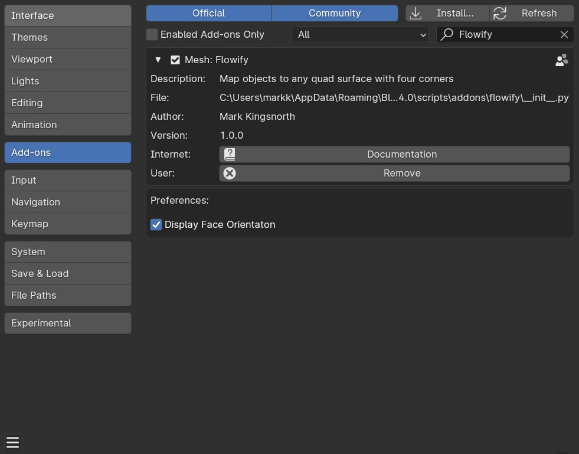

.. _installation:

#############
Installation
#############

---------------------------------
Blender 4.2 and Above
---------------------------------

.. image:: images/installation.gif
   :alt: Installation

Drag and drop the installation zip file into Blender to install the add-on.  

If you have any issues do not hesitate to get in touch via `info@configurate.net <mailto:info@configurate.net>`_.

---------------------------------
Previous Blender Versions
---------------------------------

#. Go to *Edit* -> *Preferences*.
#. Select the *Add-ons* tab on the left if it is not already.
#. Select the *Install...* button along the top.
#. This will open a file dialog. Navigate to where you have downloaded the **flowify.zip** file.

   .. warning::
    This **flowify.zip** file should not be unzipped.

#. Then, click the *Install add-on from file* button.
#. Search for the add-on by typing *Flowify* in the search box if it does not already appear.
#. Make sure the checkbox next to the Add-on (*Mesh: Flowify*) is ticked:

Upgrading
--------------------------------------

#. In Blender, Go to *Edit* -> *Preferences*.
#. Find the *Flowify* add-on entry, expand the entry and click the *Remove* button. This wil remove the old version of the add-on.
#. Restart Blender.
#. Install the new version using the instructions above. 
#. Then restart Blender.

If you have any issues do not hesitate to get in touch via `info@configurate.net <mailto:info@configurate.net>`_.
