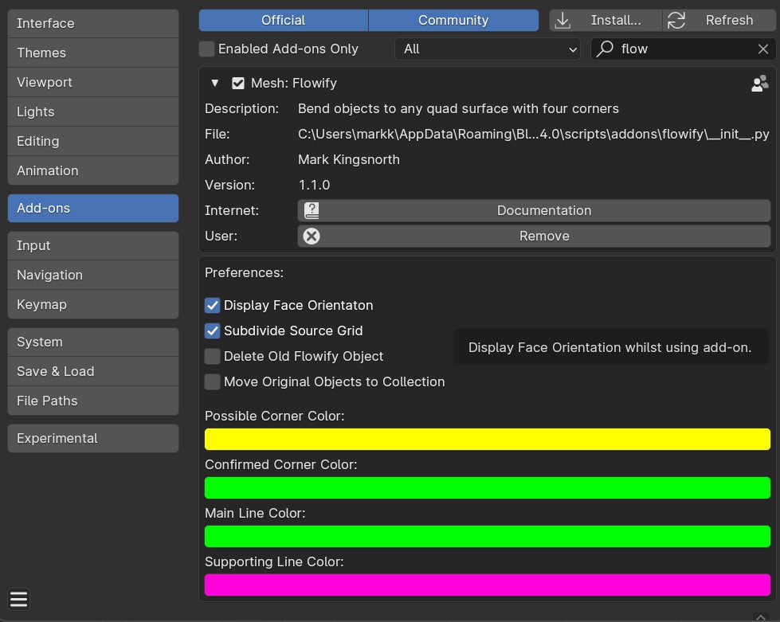

#####################################
Preferences
#####################################

.. _face_orientation:

Display Face Orientation
--------------------------------------

When running the Flowify operation, this will automatically switch the viewport to *Face Orientation* mode so that you can check that the blue positive face orientation of the **Source Grid** matches the face orientation of the **Target Surface**.  Both matching sides should be blue.

   
   Good and bad face orientations. Both matching sides of the source and the target surface objects should be blue for the add-on to work correctly.  Red faces denote inverted faces.

Delete old Flowify Object
---------------------------------------

When enabled the add-on will always delete the old Flowify object of the same name whilst running.  If disabled the original object is retained.