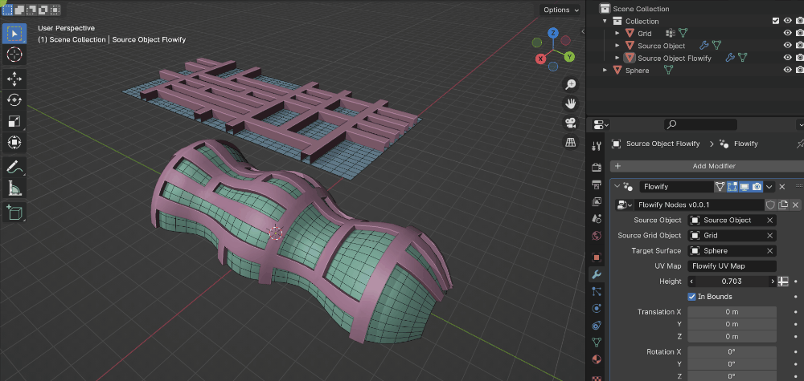

.. _settings:

#####################################
Settings
#####################################

.. _modifier_settings:

======================================================
Modifier settings
======================================================

If the resulting Flowify object is selected, there is a Flowify *Geometry Nodes* Modifier that has additional settings for the add-on:

.. image:: images/flowify_modifier.jpg

Source Object
--------------------

The Source Object the add-on will map to the Target Surface.

Source Grid
--------------------

The reference grid used to map the Source Object to the Target Surface.

Target Surface
--------------------

The Target Surface grid used to deform the Source Object.

UV Map
-----------

The name of the grid like UV Map on the Target Surface.

Height
--------------

This controls the relative height of the mesh which the add-on makes an initial guess for based on the height of the Source Object.  Changing this value multiplies the default height that has been set.

Source Object Merge Distance
----------------------------------------

Merge vertices on the Target Surface when processing (Zero = No Merge).  This is useful for "knitting together" the ends of a cylindrical surface.  The original Target Surface is not affected, only the one being copied for processing.

Source Object Merge Vertex Group
----------------------------------------

When merging vertices, use a vertex group you have added to the original Source Object to restrict the merge.

Target Object Merge Distance
--------------------------------------------------

Merge vertices on the Source Object when processing (Zero = No Merge).  This is useful for "knitting together" the ends of a cylindrical object.  The original Source Object is not affected, only the one being copied for processing.

Target Object Merge Vertex Group
----------------------------------------

When merging vertices, use a vertex group you have added to the original Target Surface to restrict the merge.

In Bounds
-----------------

By default, the modifier will try to keep all the vertices of the Source Objects within the bounds of the Target Surface.  When the vertices hit the edge of the Target Surface, they will be bunched up on that edge:

.. image:: images/bunch_up.jpg

If you wish the object's vertices and edges to be deleted if they cross an edge, you can uncheck this setting:

Translation/Rotation/Scale
--------------------------------

These settings offset the transformation of the resulting deformed object in world space.

