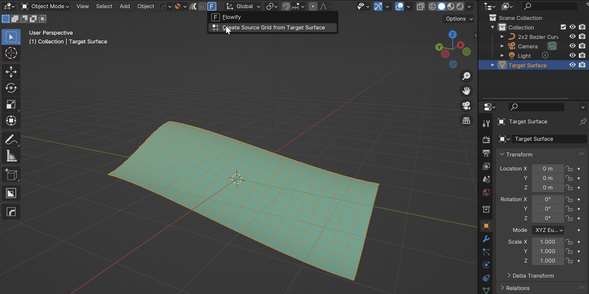
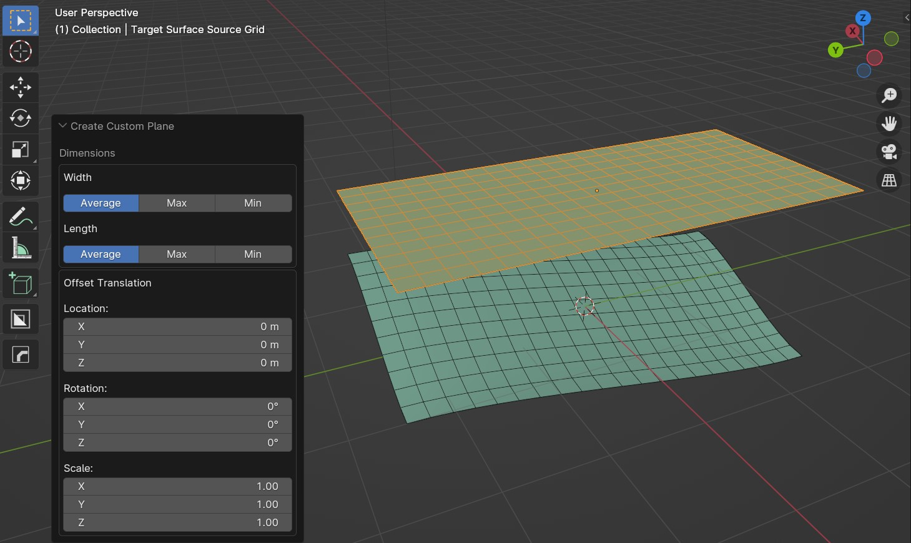

.. _tools:

#####################################
Tools
#####################################

======================================================
Create Source Grid from Target Surface
======================================================

You can choose to automatically create a flat :ref:`Source Grid<source_grid>` from any selected **Target Surface**.  Select the Target Surface, and from the Flowify menu select **Create Grid from Target Surface**.  This will create a grid that matches the dimensions of the edges running along and across the arget Surface.

Controls
------------------------

* **Width/Height**: This controls which calculation to use for the dimensions of the Source Grid:

    * **Max:** The Maximum length of the sets of edges across or down the grid.
    * **Min:** The Minimum length of the sets of edges across or down the grid.
    * **Average:** The Average length of the sets of edges across or down the grid.

* **Offset Translation**: By default the grid wil be created above the Target Surface.  These parameters control the offset from that point.

    * **Location:** Offset location of grid.
    * **Rotation:** Offset rotation of grid.
    * **Scale:** Offset scale of grid.