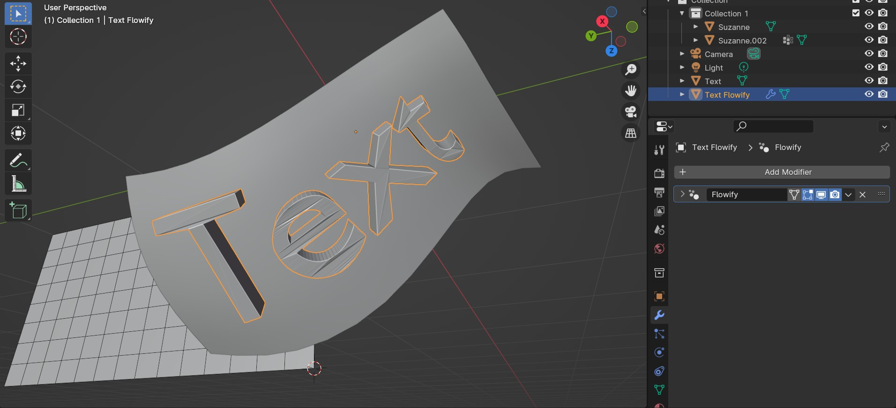
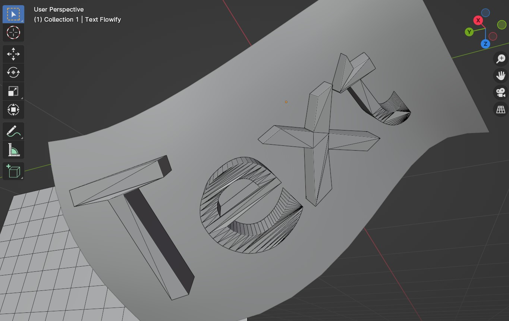

.. _troubleshooting:

#####################################
Tips and Troubleshooting
#####################################

.. note::
    If you're having any trouble and it is not answered here, don't hesitate to :ref:`contact us<Contact>`.

============================================================================================================
When using on objects like Text, I get a jagged result.
============================================================================================================

This occurs when the object does not have topology (Faces, Edges and Vertices) that allow it to be deformed well:

To resolve this, depending on what the object is needed for you can:

#. Manually retopologise the Source Object into quad based topology so that it can be more easily deformed;
#. Alternatively, you can add to the Source Object a *Remesh* modifier with a relatively small Voxel Setting (careful with smaller values that can crash Blender) combined with a *Smooth* modifier set to a high number of iterations (100-200) to smooth the result. This can work in cases where poly count matters less, such as Rendering or 3D Print applications:

    .. image:: images/text_fixed_1.jpg

    .. image:: images/text_fixed_2.jpg

============================================================================================================
I cannot move/scale/rotate the flowify object after it has been created
============================================================================================================

Because the object is linked directly to the faces on the Target Surface, moving/rotating/scaling the object origin will not change its position.  To workaround this, you can either:

#. Use the translation/rotation/scale offset parameters on the flowify object's Flowify modifier.  This will offset the object from the target object in global coordinates:

    .. image:: images/offset_controls.jpg

#. Select the Target Surface instead and move/rotate/scale it.  If you need a grid in the same position, create an Linked Duplicate (press Alt-D) of the Target Surface and move it, leaving the copy in place.

    .. image:: images/instance_copy.jpg

#. Apply the Flowify modifier on the flowify object so the object is no longer linked to the Target Surface.  This will mean the object is permanently set in its shape, however:

    .. image:: images/collapse_modifier.jpg

.. |Linked Duplicate| raw:: html

   <a href="https://docs.blender.org/manual/en/latest/scene_layout/object/editing/duplicate_linked.html">Flowify</a>

============================================================================================================
I cannot edit the flowify object after it has been created
============================================================================================================

The object is a linked copy of the original Source Object, and cannot itself be edited.  Instead, editing the Source Object will change the resulting flowify object.  If you wish to edit the Source Object, apply the Flowify Modifier which will unlink the object from the original Source Object it was created from.

    .. image:: images/collapse_modifier.jpg