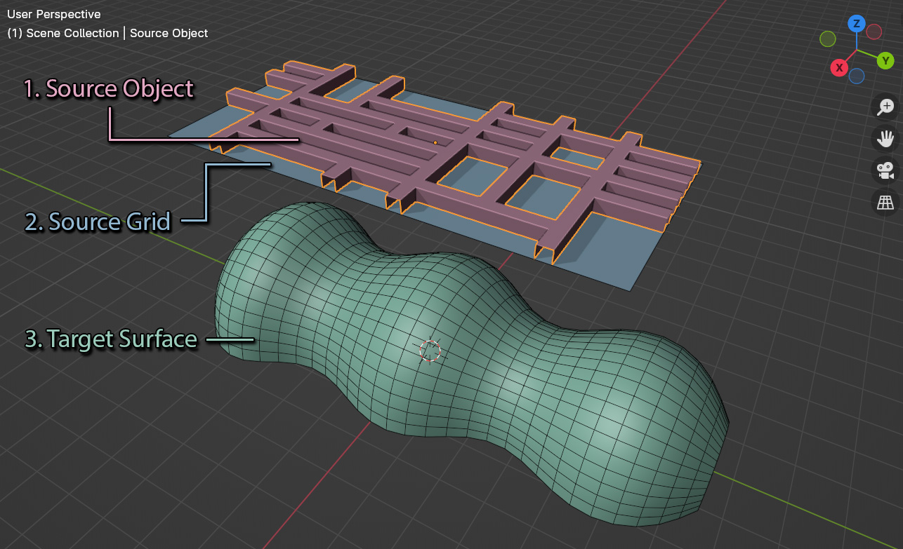
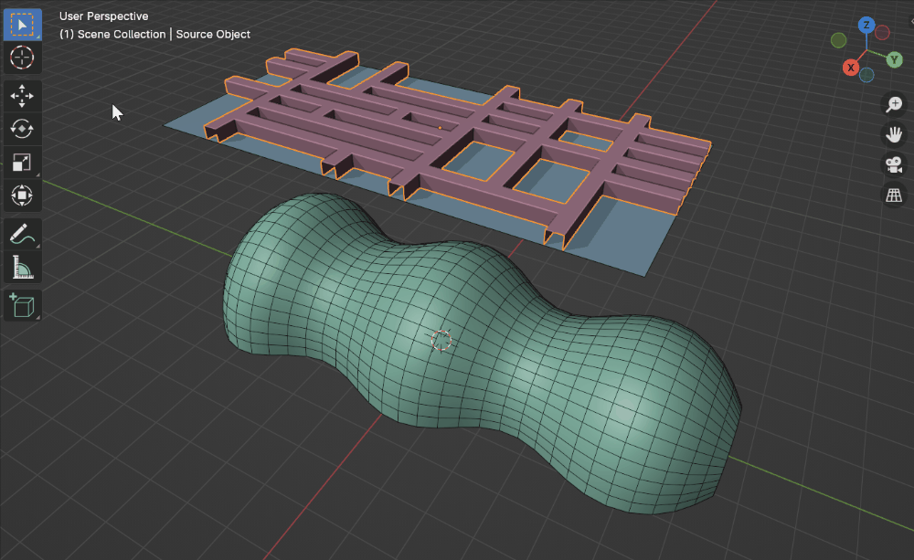

.. _howto:

#####################################
How To Use
#####################################

.. note::
    If you're having any trouble, don't hesitate to :ref:`contact us<Contact>`.

Set up Objects
------------------------

Once :ref:`installed<installation>`, for Flowify to work in Blender you will need to create the following objects arranged as above:

.. _source_object:

#. The **Source Object** that you wish to deform.

    .. note::
        The deformation will only be as good as an object’s mesh topology (Faces and Edges).  You may need to add extra faces, edges or edge loops for the object to bend well.

.. _source_grid:

#. A flat rectangular **Source Grid** to use as a reference for the :ref:`Target Surface<target_surface>`.  This should be in a relative position to where you want the Source Object mapped to the Target Surface.

    .. note::
        .. image:: images/source_grid.jpg
        
        Flowify understands a source grid to consist of 4 sided faces with 4 distinct corners and to be entirely flat.  Its face direction (or |normals|) should also match the Target Surface.

        The Source Grid can be a simple single-faced rectangle and does not need to have the same number of faces as the :ref:`Target Surface<target_surface>`.

.. _target_surface:

#. An irregularly shaped **Target Surface** consisting of **evenly spaced** 4 sided faces with 4 distinct corners.

    .. note::
        .. image:: images/target_grid.jpg
        
        The vertices of the grid must be evenly spaced for Flowify to work well.  Blender's built in |Loop Tools| add-on's *Space* operation should help with this.
        
        The target surface should also consist of 4 sided faces with 4 distinct corners.  Its face direction (or |normals|) should also match the Source Grid. 

    .. warning::
        If modifiers such as the Array or Solidify modifier have been added to the Target Surface, the add-on may not work properly.  Try applying modifiers like the Array/Solidify modifier first.  Subdivision Surface modifiers should work, and if you have any issues do :ref:`contact us<contact>`.
  
.. |Loop Tools| raw:: html

   <a href="https://docs.blender.org/manual/en/latest/addons/mesh/looptools.html" target="_blank">Loop Tools</a>

.. |normals| raw:: html

    <a href="https://docs.blender.org/manual/en/2.79/modeling/meshes/editing/normals.html" target="_blank">Normals</a>

Step by Step
---------------------

    The Flowify workflow in Blender

The workflow is as follows:

#. In object mode, **select the Source Object(s)** and right-click in the viewport.  Select 'Flowify' from the menu that appears. 

    .. image:: images/right_click_menu.jpg

    .. note:: 
        You can select multiple source objects at once.

#. By default, the viewport will change to :ref:`face orientation<face_orientation>` mode so you can make sure the face directions (or |normals|) of the **Source Grid** and **Target Surface** are pointing in the same way (ie the same blue colour).  

   You can resolve these issues by selecting the faces in edit mode, pressing Alt-N for the *Normals* menu, and selecting the *Flip* command.  If you need to make the normals more consistent and pointing outside, also try the 'Recalculate Outside' option in the same menu.

    .. image:: images/face_orientation_mode.jpg

    .. note:: 
        .. figure:: images/face_orientation_good_bad.jpg
        
        Good and bad face orientations. Both matching sides of the source and the target surface objects should be blue for the add-on to work correctly.  Red faces denote faces with their directions (or |Normals|) pointing in the opposite direction.

#. Hover the mouse over the **Source Grid** to detect a corner on the grid.  When a corner is detected, a circle will appear on the corner.  Click the left mouse button to select this corner and continue.

    .. image:: images/source_grid_corner_circle.jpg

#. Hover the mouse over the **Target Surface** and click the matching corner.  A line should appear between the Source Grid and the Target Surface, indicating how the mapping will be applied.

    .. image:: images/target_grid_corner_circle.jpg

    .. note:: 
        It is important that the corner of the **Source Grid** is aligned to the same representative corner on the **Target Surface** to match the correct orientation.

#. The **Source Object** should be mapped onto the Target Surface in a new object called *Source Object* + *Flowify*. The **Source Grid** is subdivided into faces that you can use as a reference for the position of the **Source Object** on the **Target Surface**.
    
   In this object, there is a :ref:`Flowify Modifier<modifier_settings>` which has :ref:`additional settings<modifier_settings>`:

   .. image:: images/flowify_complete.jpg

.. note::
    Check out the :ref:`Tips and Troubleshooting<troubleshooting>` section and don't hesitate to :ref:`contact us<Contact>` if you are having issues.